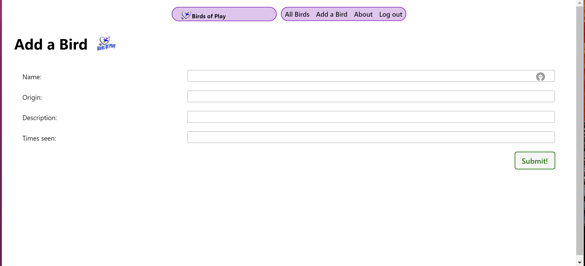

# Birds of Play
_An app built for avid digital avian collectors!_

---

---
## [Here's](https://birds-of-play.fly.dev/) a link to my application!

Birds of Play is an application designed for Digital Avian enthusiasts to create and manage their own personal list of favorite birds from video games. Users can track the number of times they have encountered each bird and provide a brief description of their unique characteristics.

---
## App Screenshots

---
## How to use my app!

To begin using the application, simply log in or sign up. Once logged in, users can start adding birds to their personal list. For each bird, provide the name, origin/appearances, a brief description, and the number of times the bird has been seen. To enhance the experience, users can also upload a photo of the bird.

---
## Future updates

- Sighting Details: Allow users to log additional information such as the date and description of each bird sighting, including the location and unique observations.
- Friends and Followers: Implement a friends list and follower mechanism to enhance social interaction and sharing within the community.

---
## Technologies used

- Python
- Django
- JavaScript
- HTML
- CSS
- Docker
- Bit.io
- Github for future updates
- Fly.io for deployment
- AWS S3 photo uploads
- Gunicorn
- Boto3

---

## Attributions

- MDN Web Docs. (n.d.). Mozilla Developer Network. https://developer.mozilla.org/en-US/

- Stack Overflow. (n.d.). Stack Exchange Inc. https://stackoverflow.com/

- Google. (n.d.). Google search engine. https://www.google.com/

- Django Docs. (n.d.). Web framework documentation https://docs.djangoproject.com/en/4.2/

---
Feel free to explore Birds of Play and embark on a captivating journey into the world of digital avian wonders!

---